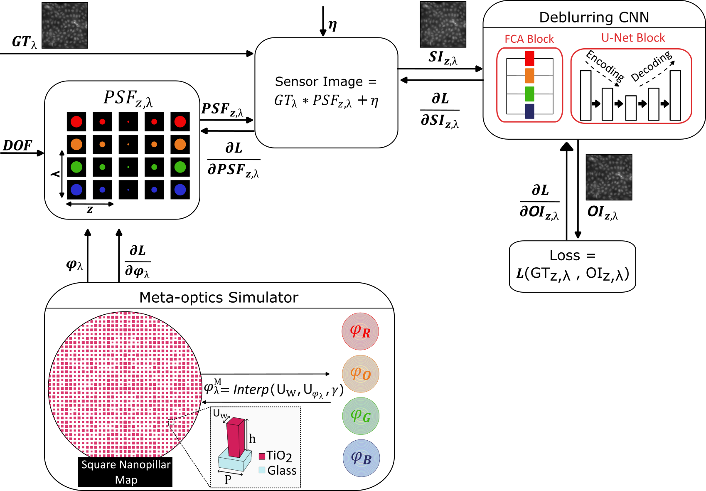
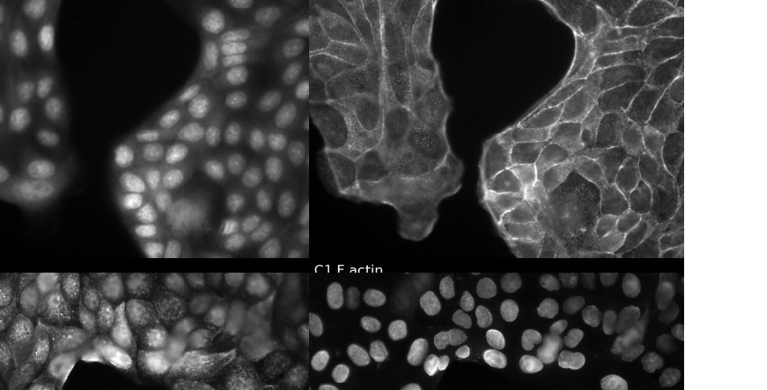

# MANTIS post processing pipeline

[](images/github_figure.png)

Reference github repository for the paper “Multispectral Extended Depth-of-Field Fluorescence Microscopy with Co-designed Meta-Optics and Neural Reconstruction” by Ipek Anil Atalay Appak, Haobijam Johnson Singh, Sanna Korpela, Teemu O. Ihalainen, Erdem Sahin, Christine Guillemot and Humeyra Caglayan. It includes training and inference code for the deblurring network, and a pretrained optical forward model provided as a TorchScript black box.

The optical model takes a ground truth input and produces a simulated sensor measurement, which can then be reconstructed by the deblurring network.

## Repository contents
- `main.py`  
  Training entry point for the deblurring network.

- `load_models_and_predict.py`  
  Inference script that loads pretrained weights, generates sensor measurements using the optical model, adds optional noise, runs deblurring, and saves outputs and metrics.

- `optic_module.pt`  
  Pretrained optical forward model in TorchScript format.

- `deblurring_module.pt`  
  Pretrained deblurring network in TorchScript format.

## Quick start

### 1. Install dependencies
```bash
pip install torch torchvision pytorch-lightning numpy matplotlib pillow
pip install piq
```
### 2. Load pretrained weights
Open the repository Releases page and download these files from **Pretrained weights v1.0.0**:
   - `optic_module.pt`
   - `deblurring_module.pt`

Place both files in the repository root directory.

### 3. Run inference
```bash
python load_models_and_predict.py
```
Outputs are written to predict_outputs, including:

- Groundtruth.png
- Sensor.png
- Output.png
- metrics.csv

## Notes on the optical model release

The optical forward model is provided as a TorchScript black box for reproducibility. The full differentiable optics implementation is not publicly released at this stage due to ongoing intellectual property protection.

The forward model and end to end training procedure are fully described in the Methods and Supplementary Information. The complete optics code can be shared upon reasonable request, subject to intellectual property constraints.

## Dataset  
Full dataset can be downloaded here Zenodo: https://zenodo.org/records/18609221 (DOI:10.5281/zenodo.18609221)
[](images/dataset.png)

## Citation
If you use this code and relevant data, please cite the corresponding paper:
